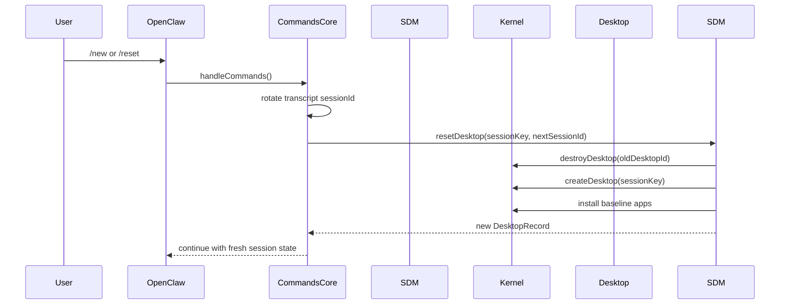
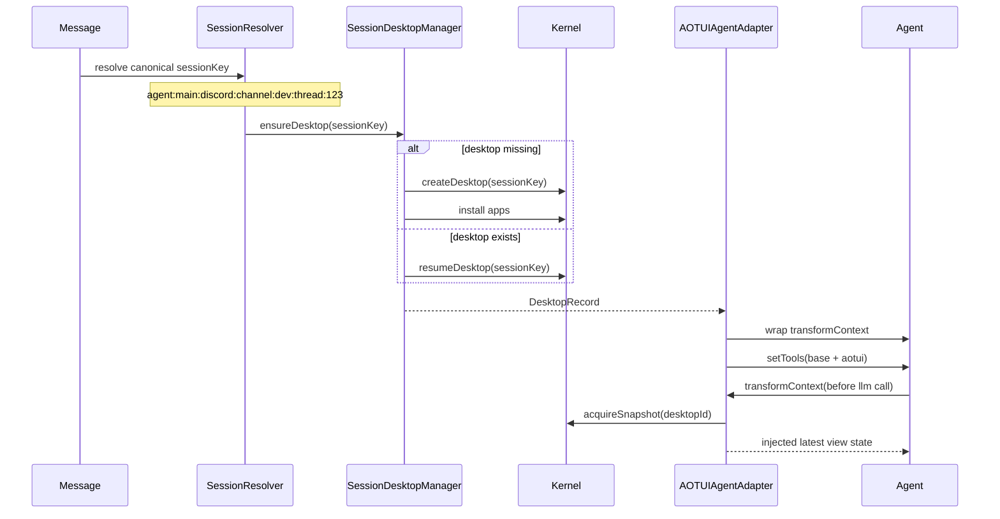
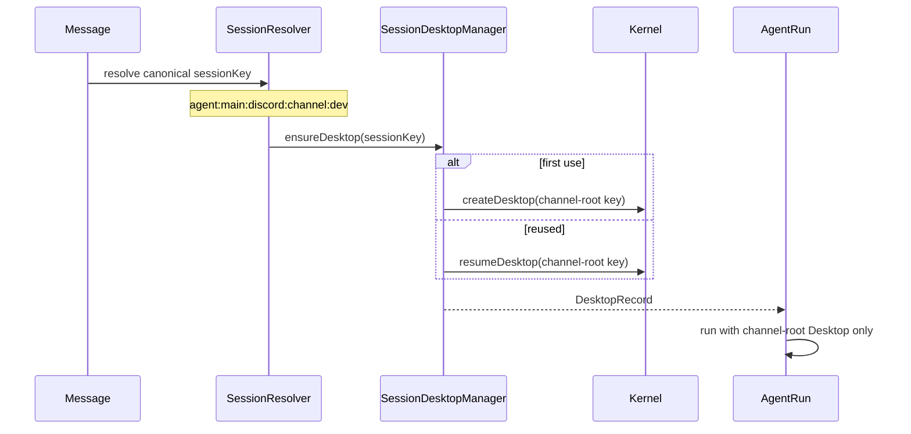
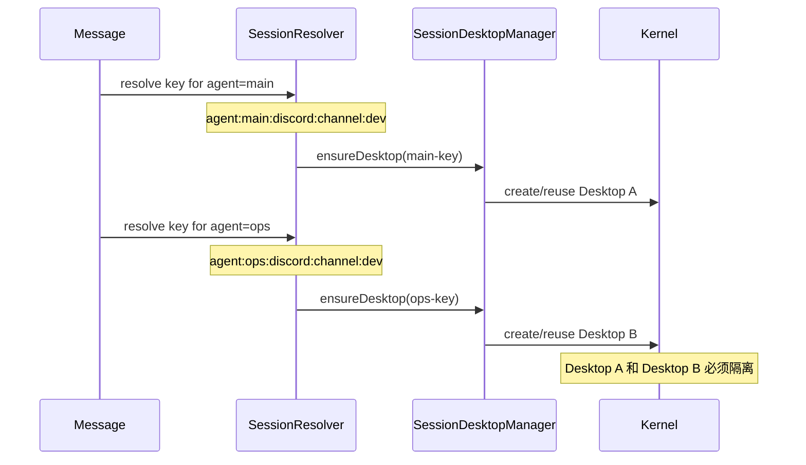

# OpenClaw × AOTUI 适配层设计方案

## 1. 背景与目标

目标是在不重写 OpenClaw 现有 Agent workloop 的前提下，把 AOTUI Runtime 作为一个会话态、可动态暴露工具和视图状态的运行时层接入 OpenClaw。

核心要求：

1. OpenClaw 继续作为唯一的 Agent orchestration 层。
2. AOTUI Runtime 只承担会话级 UI Runtime、动态 tool 暴露、视图状态投影。
3. 不改造 OpenClaw 现有的 provider、tool loop、session transcript 主模型。
4. 每个 OpenClaw canonical session key 对应一个独立 Desktop。
5. Gateway 生命周期内只有一个 Kernel；Gateway 关闭时统一关闭 Kernel。

本设计明确反对两种错误绑定：

1. 把 Desktop 绑到 runId：粒度过细，会导致每次请求都重建运行时。
2. 把 Desktop 绑到 sessionId：`/new` 和 `/reset` 会轮换 transcript 世代，但不代表路由空间变化；如果把 Desktop 身份绑到 sessionId，会让运行时身份和会话路由语义错位。

最终结论：

`desktopKey = OpenClaw canonical sessionKey`


## 2. 关键事实与约束

### 2.1 OpenClaw 的上下文分片语义

OpenClaw 已经把会话空间编码进 session key：

1. Agent 维度隔离。
2. Channel 或 group 或 direct peer 维度隔离。
3. Thread 或 topic 维度隔离。

参考实现：

1. `src/config/sessions/group.ts`
2. `src/config/sessions/session-key.ts`
3. `src/routing/session-key.ts`
4. `src/config/sessions/delivery-info.ts`
5. `src/sessions/session-key-utils.ts`

典型 session key 示例：

1. `agent:main:discord:channel:dev`
2. `agent:main:discord:channel:dev:thread:release`
3. `agent:main:telegram:group:-100123:topic:99`
4. `agent:ops:discord:channel:dev`

这意味着下面四个上下文在 OpenClaw 里天然是不同会话桶：

1. 同一个 channel root
2. 同一个 channel 下的不同 thread
3. 同一个 thread 下的不同 agent
4. 同一个 group 下的不同 agent

### 2.2 OpenClaw 的 session 概念

OpenClaw 中需要区分三类标识：

1. `sessionKey`
   逻辑会话空间标识，适合作为 Desktop 身份。

2. `sessionId`
   当前 transcript 世代标识，适合作为 JSONL transcript 标识，不适合作为 Desktop 身份。

3. `runId`
   单次 agent run 的执行标识，生命周期最短。

参考实现：

1. `src/commands/agent/session.ts`
2. `src/config/sessions/types.ts`
3. `src/commands/agent.ts`

### 2.3 AOTUI 的能力边界

AOTUI Runtime 当前已经具备以下必要能力：

1. Kernel 管理多个 Desktop。
2. Desktop 支持创建、销毁、暂停、恢复。
3. Desktop 内部 App 的 View state 可以通过 snapshot 暴露。
4. snapshot 的 indexMap 可以驱动动态 tool 集。
5. operation 执行后会改变 App 状态，进而影响下一轮可见 tools 与 View。

参考实现：

1. `runtime/src/kernel/index.ts`
2. `runtime/src/engine/core/manager.ts`
3. `runtime/src/spi/runtime/desktop-lifecycle.interface.ts`


## 3. 总体方案

### 3.1 设计原则

适配层遵循以下原则：

1. OpenClaw 的 Agent loop 不被替换，只增加 AOTUI source-like integration。
2. Gateway 进程内只持有一个 AOTUI Kernel 单例。
3. 每个 canonical session key 映射一个 Desktop。
4. AOTUI View state 不持久化到 OpenClaw transcript，只作为运行时注入上下文。
5. AOTUI tools 在每次 LLM call 前按最新 snapshot 刷新，而不是只在 run 启动时固化。

### 3.2 逻辑架构

```text
OpenClaw Gateway
  ├─ AOTUIKernelService                Gateway 级单例
  │   ├─ Kernel                        Gateway 启动时创建
  │   └─ SessionDesktopManager         管理 sessionKey -> Desktop
  │
  ├─ agentCommand / runEmbeddedAttempt
  │   └─ AOTUIAgentAdapter             每次 agent run 创建一次轻量适配器
  │       ├─ ensureDesktop(sessionKey)
  │       ├─ injectViewState(messages)
  │       ├─ refreshDynamicTools()
  │       └─ routeAotuiToolExecute()
  │
  └─ OpenClaw existing loop
      ├─ prompt build
      ├─ tool execution
      ├─ tool result persistence
      └─ retry / compaction / fallback
```


## 4. 核心类职责

## 4.1 `AOTUIKernelService`

职责：

1. 在 Gateway 启动时创建 Kernel。
2. 在 Gateway 停止时 drain 并销毁所有 Desktop，再关闭 Kernel。
3. 作为 Gateway 级共享入口，为所有 agent run 提供 SessionDesktopManager。

不负责：

1. 每次 run 的消息注入。
2. 每次 run 的 tool 刷新。
3. transcript 持久化。

建议接口：

```ts
export interface AOTUIKernelService {
  start(): Promise<void>;
  stop(reason?: string): Promise<void>;
  isStarted(): boolean;
  getKernel(): IKernel;
  getDesktopManager(): SessionDesktopManager;
}
```


## 4.2 `SessionDesktopManager`

职责：

1. 管理 `sessionKey -> DesktopRecord` 映射。
2. 按需创建、恢复、暂停、销毁 Desktop。
3. 在 `/new`、`/reset` 时重建对应 Desktop。
4. 为 agent run 返回可用的 Desktop handle。

不负责：

1. LLM prompt 组织。
2. tool schema 组装。
3. tool call 结果写入 transcript。

建议接口：

```ts
export type DesktopBindingInput = {
  sessionKey: string;
  sessionId?: string;
  agentId?: string;
  channelId?: string;
  accountId?: string;
  threadId?: string | number;
  parentSessionKey?: string;
  workspaceDir?: string;
};

export type DesktopRecord = {
  desktopKey: string;
  desktopId: string;
  sessionKey: string;
  baseSessionKey?: string;
  parentSessionKey?: string;
  threadId?: string;
  sessionId?: string;
  agentId: string;
  createdAt: number;
  lastActiveAt: number;
  status: "active" | "idle" | "suspended" | "destroying";
};

export interface SessionDesktopManager {
  ensureDesktop(input: DesktopBindingInput): Promise<DesktopRecord>;
  touchDesktop(sessionKey: string, sessionId?: string): Promise<void>;
  suspendDesktop(sessionKey: string, reason?: string): Promise<void>;
  resumeDesktop(sessionKey: string): Promise<void>;
  resetDesktop(sessionKey: string, next?: { sessionId?: string; reason?: string }): Promise<DesktopRecord>;
  destroyDesktop(sessionKey: string, reason?: string): Promise<void>;
  destroyAll(reason?: string): Promise<void>;
  getDesktop(sessionKey: string): DesktopRecord | undefined;
  listDesktops(): DesktopRecord[];
  sweepIdle(now?: number): Promise<void>;
}
```


## 4.3 `AOTUIAgentAdapter`

职责：

1. 面向单次 agent run。
2. 在 run 开始时确保 Desktop 已就绪。
3. 在每次 LLM call 前注入最新 View state。
4. 在每次 LLM call 前刷新最新 AOTUI tools。
5. 把 AOTUI tool call 路由到 Kernel.execute。
6. 过滤掉运行时注入的 View state，避免落盘到 JSONL transcript。

不负责：

1. Desktop 生命周期总控。
2. Gateway 进程生命周期。

建议接口：

```ts
export interface AOTUIAgentAdapter {
  install(): Promise<void>;
  dispose(): Promise<void>;

  getSessionKey(): string;
  getDesktopRecord(): DesktopRecord;

  ensureDesktopReady(): Promise<void>;
  buildAotuiMessages(): Promise<AgentMessage[]>;
  buildAotuiTools(): Promise<AnyAgentTool[]>;
  routeToolCall(toolName: string, args: unknown, toolCallId: string): Promise<unknown>;
  refreshToolsAndContext(): Promise<void>;
}
```


## 4.4 `AOTUISnapshotProjector`

职责：

1. 从 AOTUI snapshot 构造用于 LLM 的运行时消息。
2. 生成可识别、可替换、不可持久化的 injected messages。
3. 从 indexMap 抽取 operation 和 type tool，转为 OpenClaw 可消费的 `AnyAgentTool[]`。

建议接口：

```ts
export interface AOTUISnapshotProjector {
  projectMessages(snapshot: CachedSnapshot, meta: DesktopRecord): AgentMessage[];
  projectTools(snapshot: CachedSnapshot, meta: DesktopRecord): AnyAgentTool[];
}
```


## 5. Desktop Key 生成规则

## 5.1 规则结论

Desktop key 直接对齐 OpenClaw canonical session key。

```ts
desktopKey = canonicalSessionKey
```

不额外再定义第二套 key 规则。

### 原因

1. OpenClaw 已经把 Agent、channel、group、thread 编码进 session key。
2. 继续派生一套独立 desktop key 会引入双重身份系统。
3. reset/new 的语义、thread parent 关系、deliveryContext 都已经围绕 session key 建立。

## 5.2 归一化规则

适配层内部应只接受 canonical session key，不接受原始别名。

例如：

1. `main` 必须先被归一化成 `agent:main:main`
2. `discord:group:dev` 必须先被归一化成 `agent:main:discord:group:dev`
3. thread 必须保留 suffix：`agent:main:discord:channel:dev:thread:123`

建议提供工具函数：

```ts
export function toDesktopKey(sessionKey: string): string {
  return sessionKey.trim().toLowerCase();
}
```

## 5.3 父子关系

对 thread 或 topic 会话：

1. `desktopKey = full sessionKey`
2. `parentSessionKey = baseSessionKey`

例如：

1. channel root: `agent:main:discord:channel:dev`
2. thread: `agent:main:discord:channel:dev:thread:release`

这两个必须是两个不同 Desktop。


## 6. 关键接口设计

## 6.1 Gateway 级运行时注册

```ts
export interface AOTUIGatewayRuntime {
  kernelService: AOTUIKernelService;
  desktopManager: SessionDesktopManager;
}

export interface InstallAOTUIGatewayRuntimeOptions {
  enabled: boolean;
  workspaceDir?: string;
  appsRoot?: string;
  preloadApps?: string[];
  idleSuspendMs?: number;
  idleDestroyMs?: number;
}
```

## 6.2 单次 Run 安装

```ts
export interface CreateAOTUIAgentAdapterOptions {
  sessionKey: string;
  sessionId: string;
  agentId: string;
  workspaceDir?: string;
  channelId?: string;
  accountId?: string;
  threadId?: string | number;
  runId?: string;
  kernelService: AOTUIKernelService;
  agent: {
    setTools(tools: AnyAgentTool[]): void;
    transformContext?: (messages: AgentMessage[], signal?: AbortSignal) => Promise<AgentMessage[]>;
  };
  existingTools: AnyAgentTool[];
}
```

## 6.3 Injected Message 标识

建议把 AOTUI 注入消息标记为不可持久化的运行时消息：

```ts
type AOTUIInjectedMessageMeta = {
  aotui: true;
  aotuiKind: "system_instruction" | "desktop_state" | "view_state";
  desktopKey: string;
  snapshotId: string;
  viewId?: string;
};
```

这些消息只存在于 `transformContext` 返回值里，不进入 session transcript。


## 7. 在 OpenClaw 的接入点

## 7.1 Gateway 启动与关闭

### 接入点 1：Gateway 生命周期

文件：

1. `src/gateway/server.impl.ts`
2. `src/plugins/hook-runner-global.ts`

设计：

1. 在 Gateway 启动完成后初始化 `AOTUIKernelService.start()`。
2. 在 Gateway stop 前调用 `AOTUIKernelService.stop()`。
3. 若采用插件式激活，则可复用 `gateway_start` / `gateway_stop` hook；若采用内建适配层，则在 `startGatewayServer()` 中直接初始化更稳。

最小改动建议：

1. 在 `src/gateway/server.impl.ts` 中新增 AOTUI runtime init block。
2. 将 runtime handle 挂到 gateway runtime state，而不是塞进 plugin hook 上下文。

## 7.2 Agent run 初始化

### 接入点 2：Run 前的会话绑定与 Desktop ensure

文件：

1. `src/commands/agent.ts`
2. `src/commands/agent/session.ts`

设计：

1. 当 `agentCommandInternal()` 已解析出 canonical `sessionKey` 和 `sessionId` 后，构造 `DesktopBindingInput`。
2. 不在这里做 snapshot 注入，只做 `ensureDesktop()` 或 `touchDesktop()`。
3. run 级的上下文注入留给 attempt 阶段处理。

最小改动建议：

1. 在 session 已解析、run 准备发起前调用 `SessionDesktopManager.ensureDesktop()`。
2. 把得到的 Desktop metadata 通过 `runContext` 或新增参数继续传给 attempt。

## 7.3 Attempt 阶段安装 AOTUIAgentAdapter

### 接入点 3：createAgentSession 之后、prompt 之前

文件：

1. `src/agents/pi-embedded-runner/run/attempt.ts`

这是最关键的接入点。

原因：

1. 此时 `createAgentSession()` 已经返回可操作的 Agent 实例。
2. 还没有真正调用 `session.prompt()`。
3. 可以安全地 wrap `transformContext`。
4. 可以安全地调用 `agent.setTools()`。

设计：

1. 创建 `AOTUIAgentAdapter`。
2. adapter 在 `install()` 时完成：
   - ensure desktop ready
   - wrap transformContext
   - 首次刷新 AOTUI tools
3. 在 `dispose()` 时恢复原始 transformContext。

最小改动建议：

1. `createAgentSession()` 之后插入 ~20 到 ~40 行初始化代码。
2. 不改动 OpenClaw 原有 tool 执行 loop。

## 7.4 Tool 执行后的上下文刷新

### 接入点 4：不依赖 `after_tool_call` 做主刷新

文件：

1. `src/plugins/types.ts`
2. `src/agents/pi-embedded-subscribe.handlers.tools.ts`

结论：

`after_tool_call` 不应作为 AOTUI 刷新主路径。

原因：

1. 它是 fire-and-forget。
2. tool 执行完成后，AOTUI Worker 到 snapshot push 存在异步窗口。
3. 真正需要保证一致性的时刻是下一次 LLM call 前。

因此主刷新点必须是 `transformContext`。

`after_tool_call` 仅适合：

1. telemetry
2. 统计
3. 预热异步 refresh hint

不适合承担一致性刷新。

## 7.5 reset/new

### 接入点 5：在 reset/new 触发时重建 Desktop

文件：

1. `src/auto-reply/reply/commands-core.ts`

设计：

1. 当 `/new` 或 `/reset` 命中时，旧 session transcript 会轮换。
2. 同一个 `sessionKey` 的 UI state 也必须重建，否则会出现“新 transcript + 旧 UI 状态”的语义错位。
3. 因此应在 reset 逻辑中调用 `SessionDesktopManager.resetDesktop(sessionKey)`。

最小改动建议：

1. 在 reset 已确认生效后，新增对 Desktop reset 的调用。
2. `before_reset` hook 仍保留其现有职责，不承担 Desktop 销毁。

## 7.6 阻止 injected messages 落盘

### 接入点 6：before_message_write

文件：

1. `src/plugins/types.ts`
2. `src/agents/session-tool-result-guard-wrapper.ts`

设计：

1. 对带 AOTUI injected meta 的消息，在 `before_message_write` 中拦截并 block。
2. 如果不想依赖插件 hook，也可在 AOTUI adapter 内避免将 injected messages append 到 session manager，只在 transformContext 返回值中存在。

推荐：

以 transform-only 方式实现，不让这些消息进入 persistent context pipeline。


## 8. 运行时行为设计

## 8.0 对三个关键问题的明确结论

### 问题 1：View 能不能在每次 toolcall 之后更新

结论：

1. 能。
2. 但准确语义不是“toolcall 返回的同一瞬间就同步改写上下文”，而是“在 toolcall 完成后的下一次 LLM call 之前，View 会按最新状态重新投影到上下文”。

这是当前 OpenClaw 与 pi-agent-core loop 所允许的最稳定时序。

原因：

1. pi-agent-core 在一次 turn 中，assistant 产出 toolCalls 后，会先执行 tool。
2. tool result 被推回 `currentContext.messages`。
3. 如果还有后续 tool loop，下一轮 assistant response 开始前会再次执行 `transformContext`。
4. `transformContext` 是 `AgentMessage[] -> AgentMessage[]` 的同步入口，适合在这里重新拉取 AOTUI snapshot。

因此，AOTUI 的 View 更新主路径必须定义为：

```text
tool.execute()
  -> Kernel.execute(desktopId, operation, ownerId)
  -> App state changed
  -> Worker pushes new snapshot fragment
  -> next streamAssistantResponse()
  -> transformContext()
  -> pull latest snapshot
  -> inject latest View state messages
```

约束：

1. 不以 `after_tool_call` 作为主刷新点。
2. `after_tool_call` 最多只做 hint、metric、预热。
3. 一致性刷新只放在 `transformContext`。

### 问题 2：View 会不会重复出现在上下文里

结论：

1. 如果直接把 AOTUI messages append 到历史消息数组里，会重复。
2. 设计上必须禁止这种做法。
3. 正确实现必须是“替换式注入”，保证同一个 View 在上下文中只有最新状态。

需要注意：

1. AOTUI 现有 `getMessages()` 语义是“返回此刻全量最新视图消息”。
2. 这本身不负责去重，因为在 AgentDriver V2 里是整轮重建 context。
3. 迁移到 OpenClaw 后，如果不做额外处理，就会出现同一个 View 在多轮 loop 中反复累积。

因此适配层必须增加 injected message replacement 规则：

1. 所有 AOTUI injected message 都带稳定 meta。
2. 在每次 `transformContext` 开始时，先从 messages 中移除所有旧的 AOTUI injected messages。
3. 再插入当前 snapshot 对应的新 messages。

推荐标识：

```ts
type AOTUIInjectedMessageMeta = {
  aotui: true;
  desktopKey: string;
  snapshotId: string;
  kind: "system_instruction" | "desktop_state" | "view_state";
  viewId?: string;
};
```

替换算法：

```ts
const cleaned = messages.filter((msg) => !isAotuiInjectedMessage(msg));
const injected = projector.projectMessages(snapshot, desktopRecord);
return [...cleaned, ...injected];
```

最终保证：

1. 同一个 `desktopKey` 下，同一个 `viewId` 在上下文中只出现一次。
2. 出现的永远是最新 snapshot 对应的版本。
3. 老视图状态不会残留在 LLM 上下文里。

### 问题 3：如何将 AOTUI tool 的 toolcall 路由给 AOTUIKernel

结论：

由适配层把 AOTUI tool 投影成 OpenClaw 的 `AnyAgentTool`，其 `execute()` 直接调用 `Kernel.execute()`。

最短调用链：

```text
LLM toolCall
  -> OpenClaw ToolDefinition.execute()
  -> AnyAgentTool.execute(toolCallId, args)
  -> AOTUIAgentAdapter.routeToolCall()
  -> Kernel.execute(desktopId, operation, ownerId)
```

这里不需要发明新的 Tool dispatcher，只需要把 AOTUI tool 生成为 OpenClaw 现有工具系统认识的 `AnyAgentTool`。

推荐实现：

1. `AOTUISnapshotProjector.projectTools()` 从 snapshot.indexMap 中取出 operation entry / type tool entry。
2. 为每个 tool 生成 `AnyAgentTool`。
3. `execute()` 中解析 tool 对应的 appId、viewId、operationName。
4. 调用 `kernel.acquireLock(desktopId, ownerId)`。
5. 调用 `kernel.execute(desktopId, operation, ownerId)`。
6. 转成 OpenClaw tool result 结构返回。

推荐伪代码：

```ts
function createAotuiTool(binding: AOTUIToolBinding): AnyAgentTool {
  return {
    name: binding.toolName,
    description: binding.description,
    parameters: binding.parameters,
    execute: async (toolCallId, args) => {
      return await adapter.routeToolCall(binding.toolName, args, toolCallId);
    },
  };
}

async routeToolCall(toolName: string, args: unknown, toolCallId: string) {
  const binding = await resolveToolBindingFromSnapshot(toolName);
  const operation = {
    context: {
      appId: binding.appId,
      viewId: binding.viewId,
      snapshotId: "latest",
    },
    name: binding.operationName,
    args: args as Record<string, unknown>,
  };

  await kernel.acquireLock(desktopId, ownerId);
  try {
    const result = await kernel.execute(desktopId, operation, ownerId);
    return convertOperationResultToToolResult(toolCallId, toolName, result);
  } finally {
    await kernel.releaseLock(desktopId, ownerId);
  }
}
```

关键设计点：

1. toolName 不能只是字符串展示名，它必须能稳定反查到 operation binding。
2. 优先从 snapshot.indexMap 的 `tool:*` 元数据反查 context。
3. 不依赖模糊字符串拆分作为主路径。

这也是为什么适配层需要一份 run-time binding cache：

```ts
type AOTUIToolBinding = {
  toolName: string;
  appId: string;
  viewId?: string;
  viewType?: string;
  operationName: string;
  parameters: unknown;
  description: string;
};
```

## 8.1 View state 注入策略

在每次 `transformContext` 调用时：

1. 从 Desktop 获取最新 snapshot。
2. 清除旧的 AOTUI injected messages。
3. 投影出最新 system instruction、desktop state、view state 消息。
4. 把这些消息拼到 LLM 上下文中。

推荐顺序：

1. base persistent transcript messages
2. AOTUI system instruction
3. AOTUI desktop state
4. AOTUI view state messages

说明：

不建议把 view state 回写到 transcript 再参与 replay，否则 compaction、reset、message persistence 都会被污染。

补充约束：

1. `transformContext` 必须是幂等的。
2. 同一份输入 messages 多次经过 `transformContext`，不能无限追加 AOTUI messages。
3. 同一 `viewId` 在返回的 messages 中只能保留一份最新状态。

## 8.2 Tool 刷新策略

同样在 `transformContext` 中完成：

1. 读 snapshot.indexMap
2. 投影出最新 AOTUI tools
3. 保留 OpenClaw 原生 tools
4. 调用 `agent.setTools([...baseTools, ...aotuiTools])`

原因：

1. `transformContext` 在每次 LLM call 前触发。
2. pi-agent-core 的 `context.tools` 读取发生在 `streamAssistantResponse()` 中。
3. 该时机足够让下一轮 LLM call 感知新的 tool 集。

补充说明：

1. “每次 toolcall 之后 View 更新”在实现上等价于“每次下一轮 LLM call 前 refresh snapshot + refresh tools”。
2. 这已经足够满足 AOTUI 的状态闭环，不需要侵入 OpenClaw 内层 tool loop。

## 8.3 Idle 策略

推荐状态机：

1. `active`
2. `idle`
3. `suspended`
4. `destroyed`

推荐策略：

1. run 结束后，Desktop 进入 `idle`
2. 超过 `idleSuspendMs`，调用 `kernel.suspend(desktopId)`
3. 超过 `idleDestroyMs`，销毁 Desktop
4. 新消息进入同 sessionKey 时自动 resume 或 recreate


## 9. 四个核心场景时序图

## 9.1 reset/new



## 9.2 thread



## 9.3 channel root



## 9.4 agent 切换




## 10. 最小改动点

目标是以最小 patch 完成接入，避免横切改造 OpenClaw 主流程。

### 10.1 新增文件

建议新增：

1. `src/aotui/kernel-service.ts`
2. `src/aotui/session-desktop-manager.ts`
3. `src/aotui/agent-adapter.ts`
4. `src/aotui/snapshot-projector.ts`
5. `src/aotui/types.ts`

### 10.2 修改文件

建议只改以下少数入口：

1. `src/gateway/server.impl.ts`
   - Gateway start/stop 时安装和释放 AOTUIKernelService

2. `src/commands/agent.ts`
   - 在 session 已解析后，向 attempt 传入 AOTUI runtime handle 或 desktop binding context

3. `src/agents/pi-embedded-runner/run/attempt.ts`
   - createAgentSession 之后安装 AOTUIAgentAdapter

4. `src/auto-reply/reply/commands-core.ts`
   - `/new`、`/reset` 时触发 `resetDesktop(sessionKey)`

### 10.3 不建议改动的区域

1. OpenClaw 的 provider transport 层
2. pi-agent-core 主 loop
3. session transcript 文件格式
4. 工具注册主框架
5. compaction 主流程


## 11. 影响面评估

## 11.1 架构影响

### 正向影响

1. 把 UI runtime state 引入 OpenClaw，但不破坏其现有 agent orchestrator 地位。
2. 允许 tool 集随 App 状态变化动态更新。
3. 允许每个 session 空间拥有独立 UI runtime。

### 风险点

1. 新增 Gateway 级内存常驻对象。
2. Desktop 数量可能随 sessionKey 增长，需要 idle sweep。
3. View state 注入会增加 prompt token 压力。
4. tool 数量可能爆炸，需要裁剪策略。

## 11.2 对 OpenClaw 的影响

### 低影响区域

1. session resolution 模型无需改动。
2. transcript 持久化模型无需改动。
3. existing hooks 无需重写。

### 中影响区域

1. `attempt.ts` 需要增加 adapter 安装逻辑。
2. Gateway startup/shutdown 需要增加 runtime lifecycle。
3. reset/new 需要与 Desktop rebuild 绑定。

### 高关注风险

1. transformContext 每轮都拉 snapshot，性能需要实测。
2. snapshot 变更与 Worker flush 存在异步窗口，需要做小幅去抖或 snapshot version wait。
3. injected message 绝不能污染 transcript。

## 11.3 对 AOTUI 的影响

### 低影响区域

1. Kernel、Desktop、snapshot、operation 模型都可复用。
2. 现有 Desktop suspend/resume 生命周期可复用。

### 中影响区域

1. 需要新增 OpenClaw 侧 projector，不应复用 AgentDriver V2 的全部实现。
2. 可能需要补充更稳定的 snapshot ready 或 version 机制，减少 tool call 后的短暂旧视图窗口。


## 12. 开发计划

## 阶段 1：基础运行时骨架

目标：

1. Gateway 启动时拉起 Kernel。
2. `SessionDesktopManager.ensureDesktop()` 可用。
3. 同 sessionKey 可复用 Desktop，不同 sessionKey 隔离。

交付物：

1. `AOTUIKernelService`
2. `SessionDesktopManager`
3. Desktop idle sweep 基础实现

验收标准：

1. channel root、thread、不同 agent 三种 key 映射到不同 Desktop。
2. Gateway 停止时能干净销毁。

## 阶段 2：单次 run 注入

目标：

1. 在 `attempt.ts` 中安装 `AOTUIAgentAdapter`。
2. `transformContext` 能注入 View state。
3. AOTUI tool 能被 LLM 调用并成功路由到 Kernel。

交付物：

1. `AOTUIAgentAdapter`
2. `AOTUISnapshotProjector`

验收标准：

1. 首次 LLM call 能看到 AOTUI view state。
2. tool call 能改变 App state。
3. 下一次 LLM call 能看到更新后的 View 和 tool 集。

## 阶段 3：reset/new 与持久化边界

目标：

1. `/new` 和 `/reset` 触发 Desktop rebuild。
2. injected messages 不落盘。

交付物：

1. reset 绑定实现
2. transcript pollution guard

验收标准：

1. reset 后 transcript 清空语义与 UI state 清空语义一致。
2. JSONL transcript 中不出现 AOTUI injected messages。

## 阶段 4：性能与收敛

目标：

1. 增加 idle suspend/destroy 策略。
2. 增加 snapshot refresh 去抖与 metrics。
3. 增加 tool 数量与 prompt 大小保护。

验收标准：

1. 多 sessionKey 并存时内存可控。
2. 大视图或大量 tool 时不会显著拖垮 OpenClaw 主流程。


## 13. 测试计划

建议覆盖：

1. `SessionDesktopManager`
   - 同 key 复用
   - 不同 key 隔离
   - suspend/resume
   - reset 重建

2. `AOTUIAgentAdapter`
   - transformContext 注入
   - tool 刷新
   - injected messages 不落盘

3. 场景级测试
   - channel root -> desktop A
   - thread 1 -> desktop B
   - thread 2 -> desktop C
   - 同群不同 agent -> 不同 Desktop
   - /new -> 同 sessionKey 下重建 Desktop


## 14. 最终建议

本方案最重要的三个决策是：

1. `desktopKey = canonical sessionKey`
2. 动态刷新主路径放在 `transformContext`，而不是 `after_tool_call`
3. `/new` 和 `/reset` 时重建 Desktop，而不是仅轮换 transcript

这三点如果不成立，AOTUI 的“状态决定工具、工具影响状态、状态重新进入下一轮 Messages”的闭环就无法稳定成立。

如果后续实现中需要进一步缩小改动面，优先保留：

1. Gateway 单例 Kernel
2. SessionDesktopManager
3. attempt.ts 中的 adapter 安装

而不要优先依赖 plugin hook 把所有逻辑硬塞进去。plugin hook 可以承担增强职责，但不应承担主控制面。