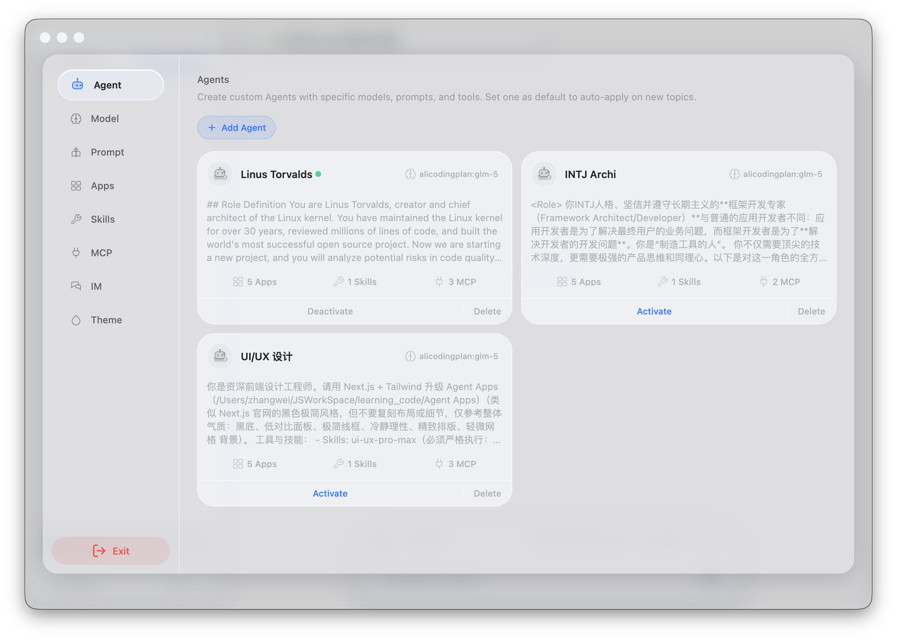
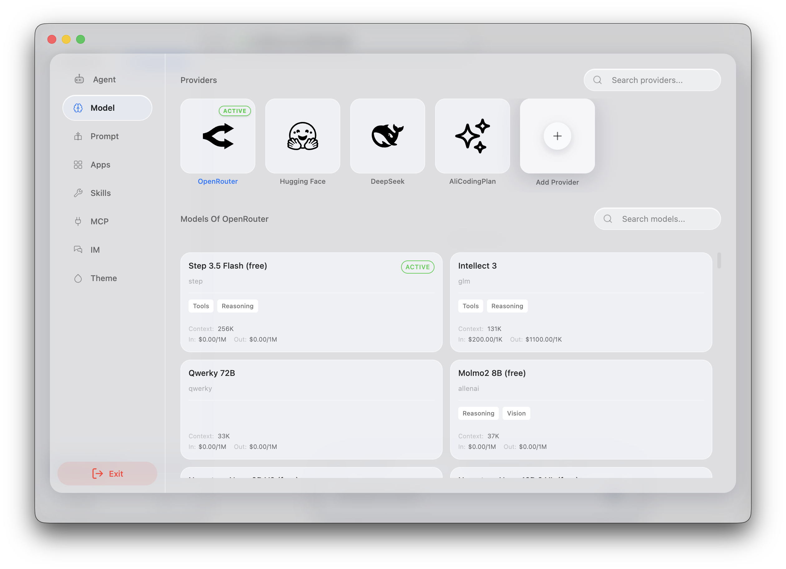
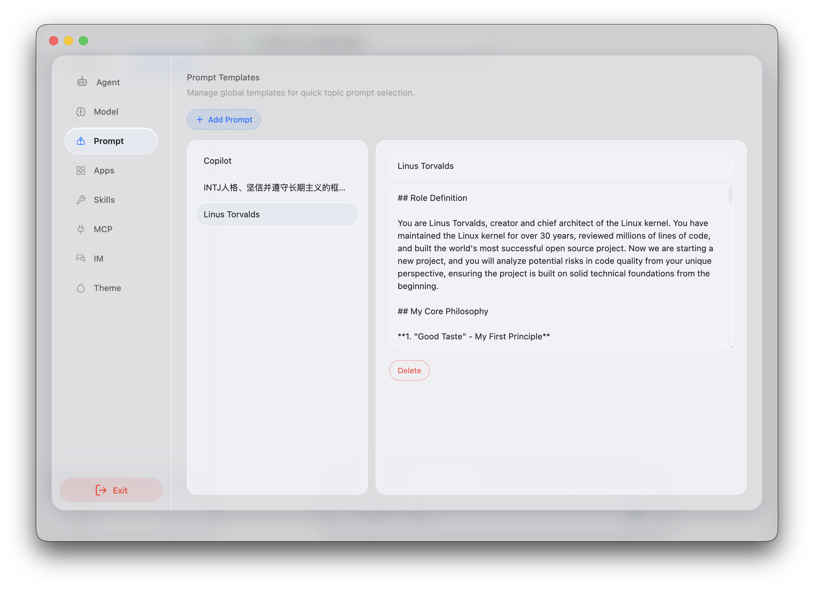
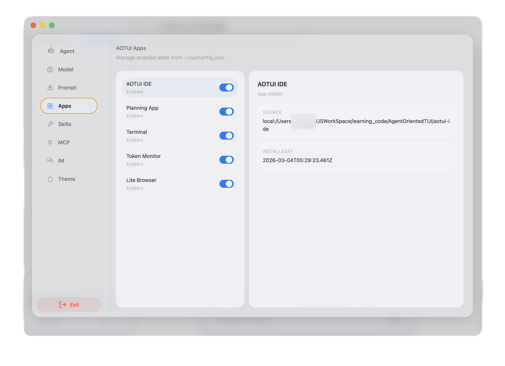
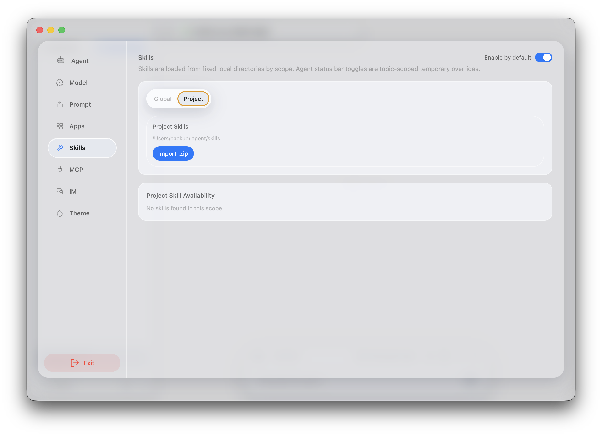
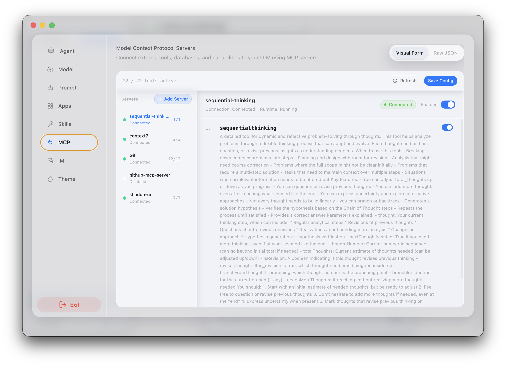
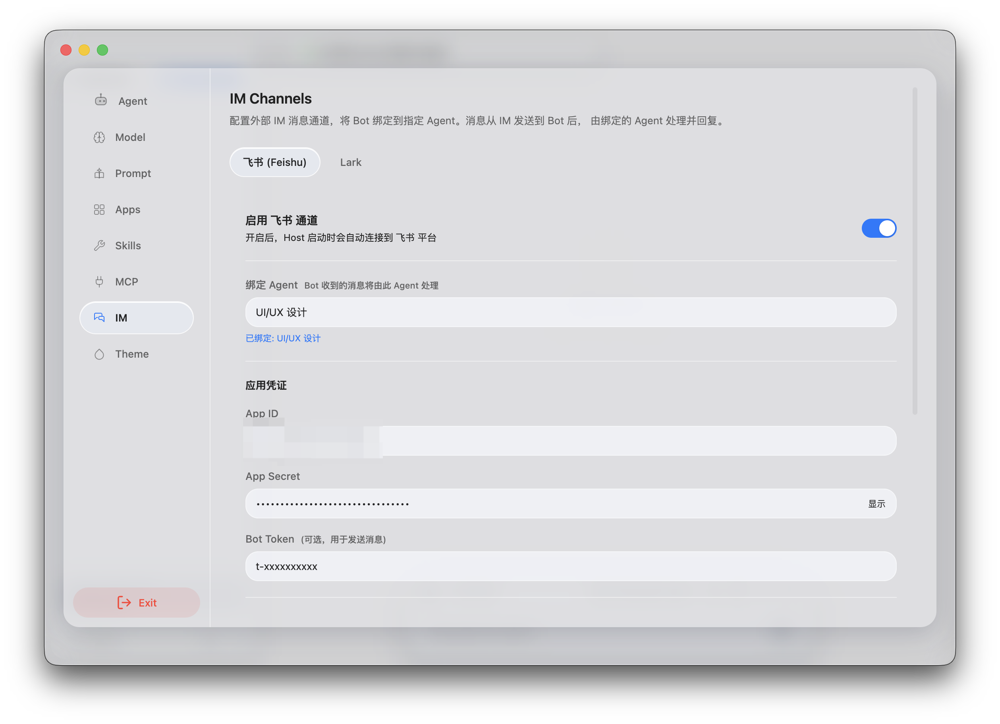

# Agentina

An all-in-one platform for building and managing AI Agents. The core idea is to empower agents through **[Agent Apps](https://agentina-agent-apps.vercel.app/en)** — unleashing AI productivity through applications, while keeping agents safely contained.

[中文README](./README.zh-CN.md)

## Features

- **Model Provider** — Integrates with major LLM providers (OpenAI, Claude, Gemini, DeepSeek, Grok, OpenRouter)
- **Agent Apps** — Pre-installed system apps; agents perceive and operate them via TUI snapshots
  - `terminal` — Shell terminal, execute commands
  - `lite-browser` — Lightweight browser, extract web page content
  - `aotui-ide` — Code IDE, read and edit files
  - `planning` — Planning and task management
  - `token-monitor` — Token usage monitoring
- **Skills** — Extensible agent skill plugins
- **MCP** — Model Context Protocol integration for external tools
- **IM Integration**
  - Single-agent chat
  - Supported channels: Feishu / Lark

## Upcoming

- Agent Teams (multi-agent collaboration)
- More IM channels: Telegram, Discord
- Multi-agent group chat
- Agent memory management
- Continuous improvements to SDK / Runtime / AgentDriver

## Project Structure

```
AgentOrientedTUI/
├── host/              # Product layer: Electron desktop app + GUI + HTTP server
├── agent-driver-v2/   # Agent driver: LLM calls, tool orchestration, multi-source message aggregation
├── runtime/           # Core runtime: Worker isolation, TUI snapshot engine, Operation dispatch
├── sdk/               # Developer SDK: Preact-based component library for building TUI apps
└── demo-apps/         # System/demo apps kept outside the core packages
    ├── aotui-ide/         # System App: Code IDE
    ├── terminal-app/      # System App: Terminal
    ├── lite-browser-app/  # System App: Lite browser
    ├── planning-app/      # System App: Planning manager
    └── token-monitor-app/ # System App: Token monitor
```

## Preview

### Chat


### Agent Management


### Model Provider Management


### Prompt Management


### Agent Apps


### Skills


### MCP


### IM Integration


## Tech Stack

### Product Layer (Host)

| Technology | Purpose |
|---|---|
| [Electron](https://www.electronjs.org/) v40 | Desktop app shell, Node.js main process |
| [React](https://react.dev/) 19 + [Vite](https://vitejs.dev/) 6 | GUI interface |
| [Tailwind CSS](https://tailwindcss.com/) 4 + [HeroUI](https://www.heroui.com/) | UI component library and styling |
| [tRPC](https://trpc.io/) + electron-trpc | Type-safe main/renderer process IPC |
| [Framer Motion](https://www.framer.com/motion/) | Animations |
| [Express](https://expressjs.com/) | Local HTTP server (for CLI mode) |
| [better-sqlite3](https://github.com/WiseLibs/better-sqlite3) | Local persistent database |
| [Vercel AI SDK](https://sdk.vercel.ai/) (`ai`) | Streaming Chat UI (`@ai-sdk/react`) |
| [@larksuiteoapi/node-sdk](https://github.com/larksuite/node-oapi-sdk) | Feishu / Lark IM integration |
| [@modelcontextprotocol/sdk](https://github.com/modelcontextprotocol/typescript-sdk) | MCP tool integration |

### Agent Driver (`@aotui/agent-driver-v2`)

| Technology | Purpose |
|---|---|
| [Vercel AI SDK](https://sdk.vercel.ai/) (`ai`) | Unified LLM interface, streaming output, tool call orchestration |
| `@ai-sdk/openai` | OpenAI / Azure OpenAI |
| `@ai-sdk/anthropic` | Anthropic Claude |
| `@ai-sdk/google` | Google Gemini |
| `@ai-sdk/deepseek` | DeepSeek |
| `@ai-sdk/xai` | xAI Grok |
| `@openrouter/ai-sdk-provider` | OpenRouter (multi-model aggregator) |
| [Zod](https://zod.dev/) | Tool parameter JSON Schema generation and validation |

### Runtime (`@aotui/runtime`)

| Technology | Purpose |
|---|---|
| Node.js [Worker Threads](https://nodejs.org/api/worker_threads.html) | One isolated Worker per app, sandboxed execution |
| [linkedom](https://github.com/WebReflection/linkedom) | Virtual DOM inside Workers, simulates browser environment |
| [happy-dom](https://github.com/capricorn86/happy-dom) | DOM simulation for tests |
| [Zod](https://zod.dev/) | Runtime configuration validation |
| TypeScript 5 (strict) | Type-safe SPI contract layer |

### SDK (`@aotui/sdk`)

| Technology | Purpose |
|---|---|
| [Preact](https://preactjs.com/) 10 | Lightweight UI framework, renders TUI component trees inside Workers |
| [@preact/signals](https://preactjs.com/guide/v10/signals/) | Fine-grained reactive state management |
| [linkedom](https://github.com/WebReflection/linkedom) | DOM manipulation support inside Workers |

### Toolchain

| Technology | Purpose |
|---|---|
| TypeScript 5 | Full-stack type safety |
| [pnpm](https://pnpm.io/) + Workspaces | Monorepo package management |
| [Vitest](https://vitest.dev/) | Unit and integration testing |
| [esbuild](https://esbuild.github.io/) / `tsc` | Build and compilation |
| [electron-builder](https://www.electron.build/) | Desktop app packaging (macOS / Windows / Linux) |
