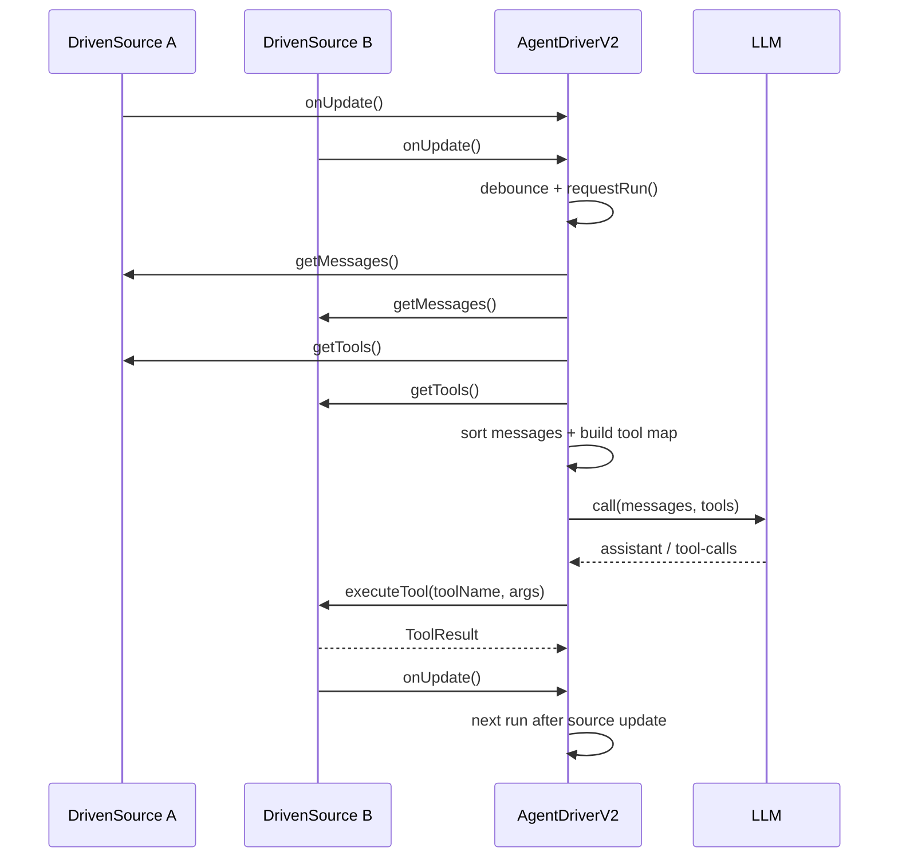

# AgentDriver DrivenSource 设计与迁移调研报告

## 目标

这份报告服务一个非常具体的目标：

把 `AgentOrientedTUI` 里的 `AgentDriver` 能力迁移到其他项目时，让接入方能够快速理解 `DrivenSource` 的 `what / why / how`，并且知道哪些语义是可以定制的，哪些不变量不能破坏。

这不是一篇泛泛而谈的源码导读，而是一份面向迁移落地的框架级说明书。

---

## TL;DR

先给结论。

1. `DrivenSource` 不是“消息适配器”，而是 Agent 的统一输入源协议。
2. 一个 `DrivenSource` 同时定义了四件事：它给模型什么上下文、给模型什么工具、工具由谁执行、状态变化后如何唤醒 Agent。
3. `AgentDriverV2` 本身非常克制，只做聚合、排序、路由和工作循环，不负责任何业务上下文。
4. 迁移时最重要的不是“把接口抄过去”，而是保留这些关键语义：
   - 消息去重由 source 自己负责
   - 工具归属由暴露该工具的 source 负责
   - `onUpdate()` 是 run loop 的唤醒机制，不是装饰品
   - `getTools()` 和 `executeTool()` 必须语义一致
   - 工具名在全局必须唯一，否则后注册的 source 会覆盖前者
   - 执行工具后，source 如果改变了可见上下文，必须主动发更新信号
5. 如果目标项目已经接了 AOTUI Runtime，最优迁移路径通常不是“自己重新投影 snapshot”，而是直接复用 `AOTUIDrivenSource`。

---

## 1. 背景与问题定义

如果没有 `DrivenSource` 这一层，任何一个 Agent 宿主系统最终都会陷入同一种结构性混乱：

1. 系统提示词由 session manager 硬编码注入
2. 聊天历史由 host 自己拼接
3. runtime 状态由另一套逻辑单独投影
4. MCP/外部工具又是一套接入方式
5. 技能系统再走另一条入口
6. IM / 外部事件 / browser memory 接入时还要重写一遍消息合并与 tool 路由

最后会出现 4 类问题：

1. 消息顺序无法稳定定义
2. tool 的所有权和执行路径混乱
3. 更新通知机制分散在多个子系统里
4. 每新增一个 source，都要修改 Agent 主循环

`DrivenSource` 的出现，本质上是在解决这个框架级问题：

**如何把“上下文来源的扩展”从“Agent 主循环”里解耦出来。**

---

## 2. What：DrivenSource 到底是什么

`IDrivenSource` 的定义非常小，但语义非常完整，见 `agent-driver-v2/src/core/interfaces.ts`。

```ts
interface IDrivenSource {
  readonly name: string;
  getMessages(): Promise<MessageWithTimestamp[]>;
  getTools(): Promise<Record<string, Tool>>;
  executeTool(toolName: string, args: unknown, toolCallId: string): Promise<ToolResult | undefined>;
  onUpdate(callback: () => void): () => void;
}
```

源码参考：

- `agent-driver-v2/src/core/interfaces.ts#L62-L132`

这 4 个方法，恰好覆盖了一个 source 对 Agent 的全部责任：

| 方法 | 语义 | 谁负责 |
| --- | --- | --- |
| `getMessages()` | 该 source 提供什么上下文 | source |
| `getTools()` | 该 source 对外暴露什么能力 | source |
| `executeTool()` | 当模型调用这个能力时，谁真正执行 | source |
| `onUpdate()` | source 状态变化后，如何唤醒 Agent 重新聚合 | source |

所以 `DrivenSource` 不是 view model，也不是 repository adapter，而是：

**一个可插拔的 Agent Control Surface。**

---

## 3. Why：为什么这个抽象是必要的

### 3.1 它把“来源”与“主循环”解耦

`AgentDriverV2` 明确只做 4 件事：

1. 聚合来自多个 source 的消息
2. 聚合来自多个 source 的工具
3. 建立 `tool -> source` 映射并做精确路由
4. 管理一次次 LLM run loop

源码参考：

- `agent-driver-v2/src/core/agent-driver-v2.ts#L4-L14`

这意味着 `AgentDriverV2` 并不知道：

1. AOTUI snapshot 长什么样
2. Host 的消息怎么存
3. MCP 工具从哪来
4. Skill 如何发现
5. IM 历史如何持久化

它只知道：这些东西都被规约成了一个个 `DrivenSource`。

### 3.2 它让能力扩展遵守开闭原则

在标准 session 装配中，`SessionManagerV3` 会挂上：

1. `SystemPromptDrivenSource`
2. `AOTUIDrivenSource`
3. `HostDrivenSourceV2`
4. `SkillDrivenSource`
5. `McpDrivenSource`

源码参考：

- `host/src/core/session-manager-v3.ts#L340-L395`

在 IM 场景下，还能并行接入 `IMDrivenSource`，而不需要改 `AgentDriverV2` 的抽象。

源码参考：

- `host/src/im/im-driven-source.ts#L323-L520`

这说明 `DrivenSource` 的价值不在“当前有几个 source”，而在于：

**以后再新增 source，主循环不需要继续膨胀。**

### 3.3 它把“控制权”放回 source 自己手里

这点特别重要。

`IDrivenSource` 的设计不是让 `AgentDriver` 去猜每个 source 的内部逻辑，而是把责任明确下放给 source：

1. 消息去重由 source 负责
2. tool 调用归属由 source 负责
3. 状态变化何时触发更新由 source 负责

也就是说，`AgentDriver` 拿到的是经过 source 自我治理后的统一契约，而不是一堆原始数据。

---

## 4. How：AgentDriver 与 DrivenSource 是如何协作的

### 4.1 总体执行流程



### 4.2 AgentDriverV2 的 run loop 关键行为

#### 1. 订阅所有 source 的更新事件

`AgentDriverV2` 在构造时就对所有 source 调用 `onUpdate()`，把更新统一导向 `requestRun()`。

源码参考：

- `agent-driver-v2/src/core/agent-driver-v2.ts#L114-L130`

#### 2. 拉取消息并按时间戳排序

`collectMessages()` 的逻辑不是做 source-specific 解释，而是：

1. 逐个 `source.getMessages()`
2. 合并
3. 按 `timestamp` 排序
4. 规范化消息格式
5. 修复 assistant tool-call / tool-result 协议顺序
6. 丢弃孤儿 tool messages

源码参考：

- `agent-driver-v2/src/core/agent-driver-v2.ts#L132-L320`
- `agent-driver-v2/tests/core/agent-driver-v2.test.ts#L93-L189`

这里非常关键的一点是：

**AgentDriver 不负责消息去重。**

`interfaces.ts` 已明确写明，这个责任属于各个 source。

#### 3. 拉取工具并建立全局映射

`collectTools()` 会遍历所有 active source，收集 `getTools()` 返回值；  
`updateToolMapping()` 再建立 `toolName -> source` 的映射。

源码参考：

- `agent-driver-v2/src/core/agent-driver-v2.ts#L322-L452`

这里存在一个迁移时必须注意的不变量：

**工具名必须全局唯一。**

因为这里是按对象合并和 `Map.set(toolName, source)` 覆盖的，后出现的 source 会覆盖先出现的同名工具。

#### 4. 输入未变化时跳过 LLM 调用

`buildInputSignature()` 会基于 messages + tools 生成签名；如果签名和上次一致，则直接跳过本轮调用。

源码参考：

- `agent-driver-v2/src/core/agent-driver-v2.ts#L532-L565`
- `agent-driver-v2/src/core/agent-driver-v2.ts#L587-L595`

这意味着迁移方不能假设“每次 update 都一定触发一次 LLM 调用”。

#### 5. Tool 调用后不立即递归下一轮，而是等待 source 更新

这是整个设计里最容易被忽略、但最不能破坏的一个语义。

`AgentDriverV2.run()` 在 tool 执行完之后，不会立刻继续新一轮 LLM；它会回到 `idle`，等待 source 在状态更新完成后主动发 `onUpdate()`，然后再开启下一轮。

源码参考：

- `agent-driver-v2/src/core/agent-driver-v2.ts#L633-L682`

这背后的设计动机是：

1. 工具执行只是“副作用开始”
2. 真正给 LLM 看的，是工具执行后的新上下文
3. 而新上下文什么时候准备好，只有 source 自己知道

这就是为什么 `onUpdate()` 不是可有可无的钩子，而是 run loop 的同步边界。

---

## 5. 内置 DrivenSource 的职责画像

### 5.1 SystemPromptDrivenSource

职责极其单纯：

1. 提供一条 `role=system, timestamp=0` 的消息
2. 不提供 tools
3. 不执行 tools
4. 支持更新 system prompt 后重新触发 source 更新

源码参考：

- `host/src/adapters/system-prompt-source.ts#L1-L165`

它的价值在于把“persona / 系统规约”也纳入 source 体系，而不是塞进主循环的硬编码副作用。

### 5.2 HostDrivenSourceV2

职责是代表“会话本身”：

1. 读取聊天历史：`messageService.getMessagesForLLM(topicId)`
2. 暴露 `context_compact` 工具
3. 执行压缩时调用 `messageService.compactContext(...)`
4. 压缩完成后通过 `notifyNewMessage()` 唤醒 Agent

源码参考：

- `host/src/adapters/host-driven-source.ts#L52-L225`
- `host/src/adapters/host-driven-source.ts#L331-L352`
- `host/src/core/message-service-v2.ts#L268-L280`

这里体现了一个非常重要的设计原则：

**上下文压缩也是一种 source-owned tool。**

它不是 AgentDriver 的职责，也不是 LLM 框架层的职责，而是“对话历史这个 source”的内部治理能力。

### 5.3 SkillDrivenSource

职责是把技能系统以一个 `skill` 工具暴露给模型。

1. 不提供消息
2. 动态发现技能列表
3. 暴露 `skill` 工具
4. 执行后返回 skill 内容，并主动触发更新

源码参考：

- `host/src/skills/skill-driven-source.ts#L14-L172`

注意，这里“skill 的执行结果”不是立即写到某个固定上下文区，而是通过 tool result 返回给对话协议，再由 driver 的下一轮继续消费。

### 5.4 McpDrivenSource

职责是把 MCP 工具作为一个纯工具型 source 接进来。

1. 不提供消息
2. `getTools()` 从 `MCP.tools()` 拉工具
3. `executeTool()` 直接调用 MCP tool 的 `execute`
4. 成功和失败都会 `triggerUpdate()`

源码参考：

- `host/src/mcp/source.ts#L10-L143`

为什么失败也要发更新？

因为从 AgentDriver 视角，错误结果同样是下一轮推理必须看到的“新上下文”。

### 5.5 IMDrivenSource

它证明了 `DrivenSource` 并不是只为 GUI/host 场景设计的，而是可以迁移到其他交互通道。

职责和 `HostDrivenSourceV2` 类似，但作用域是 IM 会话：

1. 维护 IM 的 active window
2. 暴露 `context_compact`
3. 执行压缩后替换历史
4. 通过 `notifyUpdate()` 唤醒 Agent

源码参考：

- `host/src/im/im-driven-source.ts#L323-L520`

这个实现对迁移方最大的启发是：

**你不必迁移整个 host，只要把你的“会话上下文层”包成一个 DrivenSource 即可。**

---

## 6. AOTUIDrivenSource：最关键也最复杂的那个 source

如果说 `DrivenSource` 是 AgentDriver 的通用扩展点，那么 `AOTUIDrivenSource` 就是 AOTUI Runtime 接入 Agent 世界的桥。

### 6.1 它的职责

`AOTUIDrivenSource` 做了 4 件关键事：

1. 把 runtime snapshot 翻译成 Agent 消息
2. 把 snapshot 中的 app/view tools 翻译成 AI SDK tool schema
3. 补充 runtime 的 system tools
4. 把 tool call 翻译回 runtime operation 执行

源码参考：

- `runtime/src/adapters/aotui-driven-source.ts#L1-L703`

### 6.2 它如何提供消息

`getMessages()` 的语义顺序是：

1. 可选注入 AOTUI instruction，`timestamp=1`
2. 调 `kernel.acquireSnapshot(desktop.id)` 拉最新 snapshot
3. 优先使用 `snapshot.structured`
4. 如果存在 `viewStates`，以 view 为粒度生成消息
5. 否则退回 `appStates`
6. 再不行退回 legacy `markup`
7. 最后 `releaseSnapshot(snapshot.id)`

源码参考：

- `runtime/src/adapters/aotui-driven-source.ts#L251-L356`
- `runtime/src/adapters/aotui-driven-source.test.ts#L274-L384`

这里有几个迁移时很重要的点：

#### 1. instruction 不是 `system`，而是 `user`

`AOTUIDrivenSource` 的 instruction 用的是 `role='user', timestamp=1`，而系统角色约束来自 `SystemPromptDrivenSource(timestamp=0)`。

这意味着：

1. 全局人格/系统规约由 system prompt 管
2. AOTUI runtime 的操作说明由 instruction 管

两者是分层的，不建议迁移时把它们重新混成一条大 prompt。

#### 2. view-level message 是首选，不是 app-level markup

一旦 `structured.viewStates` 存在，`AOTUIDrivenSource` 会优先把每个 view 包装成：

```xml
<view id="..." type="..." name="..." app_id="..." app_name="...">
  ...
</view>
```

这样做的意义是：

1. 给 LLM 更稳定的视图语义边界
2. 避免只看到一整坨 app markup
3. 让“哪个 view 正在被观察”更明确

#### 3. 它使用 pull-lease 读取 snapshot

这里不是长期持有 snapshot，而是：

1. acquire
2. 读取
3. release

这说明 snapshot 是 runtime 的受控资源，不应该在 source 之外被随意缓存。

### 6.3 它如何提供工具

`getTools()` 分两段：

1. 从 `snapshot.indexMap` 提取 app tools / type tools
2. 从 `kernel.getSystemToolDefinitions()` 补 system tools

源码参考：

- `runtime/src/adapters/aotui-driven-source.ts#L358-L428`
- `runtime/src/adapters/aotui-driven-source.test.ts#L216-L272`

这是迁移里最常见、也最容易犯错的地方。

**不要假设 system tools 一定在 snapshot 里。**

在当前设计里：

1. `snapshot.indexMap` 是 app/view 数据面
2. `kernel.getSystemToolDefinitions()` 是 system control plane

如果其它项目只扫描 `snapshot.indexMap`，就会漏掉 `system-open_app`、`system-close_app` 等 system tools。

### 6.4 它如何执行工具

`executeTool()` 的逻辑可以概括为：

1. 先解析 `toolName`
2. system tool 走 `system-*` 前缀
3. app/view/type tool 优先通过 `snapshot.indexMap` 元数据还原上下文
4. 构造 `Operation`
5. `kernel.acquireLock(...)`
6. `kernel.execute(desktop.id, operation, ownerId)`
7. 转成 `ToolResult`
8. 最后释放锁

源码参考：

- `runtime/src/adapters/aotui-driven-source.ts#L430-L577`
- `runtime/src/adapters/aotui-driven-source.test.ts#L5-L48`

这里迁移时最重要的经验是：

**不要靠字符串猜 tool 上下文，优先用 snapshot/indexMap 里的真实元数据。**

尤其是 type tool，如果你只依赖 toolName 命名规则做拆分，后续命名一旦变更就会漂移。

### 6.5 它如何监听更新

`AOTUIDrivenSource.onUpdate()` 直接订阅 `desktop.output`。

源码参考：

- `runtime/src/adapters/aotui-driven-source.ts#L580-L598`
- `runtime/src/engine/core/desktop.ts#L128-L130`

这件事非常说明问题：

1. `AOTUIDrivenSource` 不自己维护状态变化
2. 它信任 runtime 的 signal bus 作为唯一更新源
3. 迁移方如果已经接入 runtime，应该优先复用这条官方信号链，而不是自己做轮询

---

## 7. 迁移时必须保留的不变量

这一节最重要。

如果你只想做“最小正确迁移”，请优先遵守这些规则。

### 7.1 消息去重必须由 source 自己负责

`AgentDriverV2.collectMessages()` 只做合并、排序、协议修正，不做跨 source 的智能去重。

所以：

1. 如果你的 source 返回重复消息，AgentDriver 不会帮你兜底
2. source 应只返回“当前应该给 LLM 看的消息窗口”

### 7.2 工具所有权必须单一

一个 tool 暴露自哪个 source，就必须由哪个 source 执行。  
不要让 source A 暴露工具，却让 source B 负责执行。

否则 `tool -> source` 映射就失去意义。

### 7.3 `getTools()` 与 `executeTool()` 必须严格一致

任何 source 都必须满足：

1. `getTools()` 暴露出来的 tool，可以被本 source `executeTool()` 正确执行
2. 本 source 不拥有的 tool，`executeTool()` 必须返回 `undefined`

这是 `AgentDriverV2.executeToolCalls()` 正常工作的前提。

### 7.4 工具名必须全局唯一

当前实现中，同名工具会发生覆盖：

1. `collectTools()` 对象合并会覆盖
2. `updateToolMapping()` 中 `Map.set()` 也会覆盖

因此迁移时应该建立清晰的命名空间策略，例如：

1. `system-*`
2. `mcp__server__tool`
3. `appId.viewType.toolName`
4. `skill`

### 7.5 tool 执行后，如果上下文变了，source 必须主动发更新

这是最容易漏掉的约束。

示例：

1. `HostDrivenSourceV2` 在上下文压缩后 `notifyNewMessage()`
2. `SkillDrivenSource` 在技能加载后 `triggerUpdate()`
3. `McpDrivenSource` 成功和失败都会 `triggerUpdate()`
4. `AOTUIDrivenSource` 自己订阅 runtime output，所以 runtime 变了就会收到信号

如果迁移方漏掉这条，系统会出现一种非常隐蔽的问题：

**tool 实际执行成功了，但 Agent 下一轮永远看不到新状态。**

### 7.6 不要重新发明 AOTUI 的 tool 投影逻辑

如果目标项目已经使用了 AOTUI runtime，最优方案通常是直接接 `AOTUIDrivenSource`。

次优方案才是自己复刻它的两段逻辑：

1. app tools 来自 `snapshot.indexMap`
2. system tools 来自 `kernel.getSystemToolDefinitions()`

只认 `snapshot.indexMap` 是不完整的。

### 7.7 不要破坏 assistant tool-call / tool-result 协议连续性

`AgentDriverV2.collectMessages()` 会主动修正协议顺序，并丢弃 orphan tool message。

源码参考：

- `agent-driver-v2/src/core/agent-driver-v2.ts#L216-L319`

如果迁移方自己的消息存储层在持久化和恢复时破坏了这层结构，模型上下文会变得不稳定，尤其在多轮 tool 使用中会出错。

---

## 8. 推荐迁移策略

### 方案 A：完整复用 AgentDriverV2 + IDrivenSource

适用场景：

1. 目标项目愿意接受 `AgentDriverV2` 的工作循环
2. 目标项目可以提供或复用 `IDrivenSource`
3. 希望长期跟随 AOTUI 的 source 扩展模式演进

推荐度：最高

优点：

1. 最贴近现有主干架构
2. 后续新增 source 的成本最低
3. AOTUI/Host/MCP/Skill/IM 的经验都能复用

### 方案 B：目标项目保留自己的 Agent Orchestrator，但采纳 DrivenSource 协议

适用场景：

1. 目标项目已有稳定的 LLM orchestration
2. 不方便直接引入 `AgentDriverV2`
3. 但愿意将“来源层”统一抽象成 `DrivenSource`

推荐度：高

建议：

1. 至少保留 `IDrivenSource` 的 4 个核心动作
2. 保留“source 自己负责去重 / tool 所有权 / 更新通知”的语义
3. 明确保留“tool 后等待 source 更新再继续”的机制

### 方案 C：目标项目只想接 AOTUI Runtime 能力

适用场景：

1. 目标项目已有自己的 source 聚合层
2. 只想把 runtime 接成其中一个 source

推荐度：中高

建议：

1. 直接复用 `AOTUIDrivenSource`
2. 不要只读 snapshot 自己投影 system tools

这也是 `docs/openclaw-system-tools-integration.md` 里推荐的路径。

---

## 9. 迁移实施步骤

下面这套步骤，是我认为其它项目可以最快、也最不容易走偏的落地路径。

### 第 1 步：先盘点你有哪些 source

把目标项目里的“上下文来源”和“能力来源”列出来，按 source 拆分，而不是按技术模块拆分。

例如：

1. 系统提示词 source
2. 会话历史 source
3. 运行时状态 source
4. 外部工具 source
5. 技能/模板 source
6. IM/事件流 source

### 第 2 步：为每类 source 明确 4 个问题

对每个 source，都必须回答：

1. 它给模型什么消息？
2. 它给模型什么工具？
3. 这些工具谁执行？
4. 它状态变了以后谁来通知 Agent？

如果这 4 个问题答不清，这个 source 就还没有被真正抽象出来。

### 第 3 步：先实现最小 `IDrivenSource`

建议优先为这些 source 建一个最薄的适配层：

1. SystemPrompt
2. Conversation / History
3. Runtime / App state
4. External tools

复杂功能如 compaction、source 开关控制、app 级禁用，可以放第二阶段。

### 第 4 步：建立统一的时间戳策略

推荐最少定义出这些层级：

1. `system prompt`: `timestamp = 0`
2. `runtime instruction`: `timestamp = 1`
3. `runtime desktop/app/view state`: 使用实际运行时间
4. `conversation`: 使用消息真实时间

核心原则不是具体数值，而是：

**全局排序必须能稳定表达“谁应该先被模型看到”。**

### 第 5 步：建立工具命名空间

如果你不先做命名空间治理，后面一定会出现 tool collision。

建议：

1. system 工具显式前缀化
2. runtime type tool 保留 app/view/type 语义
3. 外部 provider/MCP 工具带 server 前缀

### 第 6 步：把更新信号接通

这是迁移成败的关键。

每个 source 都要明确：

1. 新消息到来时是否要发更新
2. 工具执行完成时是否要发更新
3. 工具失败时是否也要发更新
4. source 开关状态变化时是否要发更新

如果某个 source 没有天然事件流，就至少要在状态变更入口里手动触发。

### 第 7 步：最后再考虑优化能力

例如：

1. 输入签名跳过重复调用
2. source enable/disable
3. context compaction
4. tool 执行失败重试
5. app / server / skill 级精细控制

这些都属于正确性之上的第二层能力。

---

## 10. 迁移代码骨架

### 10.1 一个最小可用的 DrivenSource 模板

```ts
import type { IDrivenSource, MessageWithTimestamp, ToolResult } from '@aotui/agent-driver-v2'
import type { Tool } from 'ai'

export class MyDrivenSource implements IDrivenSource {
  readonly name = 'MySource'

  private listeners = new Set<() => void>()

  async getMessages(): Promise<MessageWithTimestamp[]> {
    return []
  }

  async getTools(): Promise<Record<string, Tool>> {
    return {}
  }

  async executeTool(
    toolName: string,
    args: unknown,
    toolCallId: string,
  ): Promise<ToolResult | undefined> {
    return undefined
  }

  onUpdate(callback: () => void): () => void {
    this.listeners.add(callback)
    return () => this.listeners.delete(callback)
  }

  protected triggerUpdate(): void {
    for (const listener of this.listeners) {
      listener()
    }
  }
}
```

### 10.2 一个最小可用的接线方式

```ts
const driver = new AgentDriverV2({
  sources: [
    new SystemPromptDrivenSource({ systemPrompt }),
    new RuntimeDrivenSource(runtimeHandle),
    new ConversationDrivenSource(messageRepo, topicId),
    new ExternalToolsDrivenSource(toolRegistry),
  ],
  llm: {
    model: 'openai:gpt-4.1',
    apiKey: process.env.OPENAI_API_KEY,
  },
  onAssistantMessage: (message) => saveAssistantMessage(message),
  onToolResult: (message) => saveToolMessage(message),
})
```

### 10.3 如果目标项目已经有 AOTUI Runtime

```ts
import { AOTUIDrivenSource } from '@aotui/runtime/adapters'

const aotuiSource = new AOTUIDrivenSource(desktop, kernel, {
  includeInstruction: true,
})

const driver = new AgentDriverV2({
  sources: [
    new SystemPromptDrivenSource({ systemPrompt }),
    aotuiSource,
    new HostDrivenSourceV2(messageService, topicId),
  ],
  llm,
})
```

这个方案的价值是：  
你不是“接了一个 runtime snapshot”，而是“接入了一整套 runtime -> agent 的官方桥接层”。

---

## 11. 常见迁移错误

### 错误 1：把 DrivenSource 理解成“只返回消息”

错误原因：

1. 只做了消息聚合
2. tool 暴露和执行仍然散落在外部

后果：

1. tool 所有权模糊
2. AgentDriver 无法做稳定路由

### 错误 2：把 tool 执行放到中央 dispatcher

错误原因：

1. 想图省事，在 AgentDriver 外部统一 `switch(toolName)`

后果：

1. 工具所有权回到了中心层
2. source 抽象名存实亡
3. 新增 source 又要改中央逻辑

### 错误 3：tool 执行后不触发更新

这是最常见也最隐蔽的问题。

后果：

1. LLM 看不到 tool 执行后的新上下文
2. 系统表面上“工具成功了”，实际上 agent loop 卡住了

### 错误 4：只从 snapshot 里找 system tools

后果：

1. system tools 不完整
2. 与 host 的行为分叉

正确做法：

1. app/view tools 看 `snapshot.indexMap`
2. system tools 看 `kernel.getSystemToolDefinitions()`

### 错误 5：source 返回完整历史，不做窗口治理

后果：

1. 重复消息越来越多
2. 输入签名难以稳定
3. context 成本暴涨

正确做法：

1. source 只返回当前 LLM 需要看到的消息窗口
2. compaction 也是 source 的职责，而不是 driver 的职责

### 错误 6：tool 名没有命名空间

后果：

1. 不同 source 的工具互相覆盖
2. 路由结果不稳定

---

## 12. 推荐测试清单

迁移完成后，至少验证下面这些行为。

### 12.1 抽象正确性

1. 每个 source 都能独立 `getMessages()`
2. 每个 source 都能独立 `getTools()`
3. source 不拥有的工具，`executeTool()` 返回 `undefined`
4. source 状态变化能触发 `onUpdate()`

### 12.2 AgentDriver 正确性

1. 多 source 消息能按时间戳排序
2. tool 能正确路由回所属 source
3. 同名工具能被测试捕获为冲突
4. 输入未变化时会跳过重复 LLM 调用

### 12.3 协议正确性

1. assistant tool-call 后，tool-result 能正确出现在其后
2. orphan tool message 会被过滤
3. tool 执行失败时，错误结果也能进入下一轮上下文

### 12.4 AOTUI Runtime 接入正确性

1. 能看到 app tools
2. 能看到 system tools
3. type tool 能正确恢复 app/view 上下文
4. runtime state 更新后会通过 `desktop.output` 唤醒 driver

---

## 13. 对其它项目的最终建议

如果目标是“尽快迁过去”，最容易犯的错误就是只搬运 API，不搬运语义。  
而 `DrivenSource` 真正值钱的地方，不在那 4 个方法本身，而在这些方法背后承诺的控制边界。

我建议其它项目按下面的优先级做：

1. 先接受 `DrivenSource` 是 source-owned context/tool/update contract，而不是单纯 adapter
2. 再决定是否直接复用 `AgentDriverV2`
3. 如果已经接入 AOTUI Runtime，优先直接复用 `AOTUIDrivenSource`
4. 迁移时先确保 `onUpdate`、tool ownership、timestamp ordering、tool naming 这四个不变量成立
5. 最后再做 compaction、开关控制、优化与观测

一句话总结：

**DrivenSource 不是为了“把东西接进 Agent”而设计的，DrivenSource 是为了让 Agent 的输入边界可以长期演化而不把主循环拖垮。**

---

## 14. 关键源码参考

### AgentDriver / 接口

- `agent-driver-v2/src/core/interfaces.ts`
- `agent-driver-v2/src/core/agent-driver-v2.ts`
- `agent-driver-v2/tests/core/agent-driver-v2.test.ts`
- `agent-driver-v2/tests/core/state-machine.test.ts`

### AOTUI Runtime 侧

- `runtime/src/adapters/aotui-driven-source.ts`
- `runtime/src/adapters/aotui-driven-source.test.ts`
- `runtime/src/engine/core/desktop.ts`

### Host / Session 装配侧

- `host/src/core/session-manager-v3.ts`
- `host/src/adapters/system-prompt-source.ts`
- `host/src/adapters/host-driven-source.ts`
- `host/src/core/message-service-v2.ts`

### 外部工具 / 技能 / IM 扩展

- `host/src/mcp/source.ts`
- `host/src/skills/skill-driven-source.ts`
- `host/src/im/im-driven-source.ts`

### 相关补充文档

- `docs/runtime-sdk-driven-source-analysis.md`
- `docs/openclaw-system-tools-integration.md`
