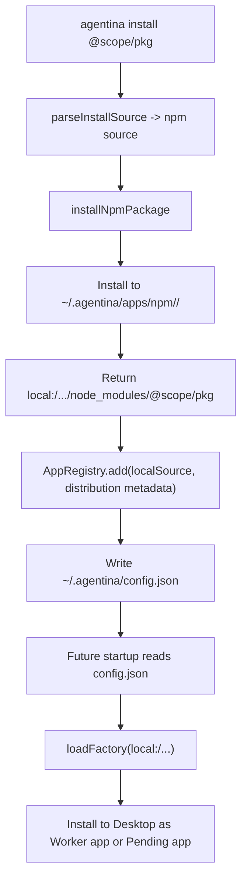

# agentina CLI 如何通过 npm 安装 TUI App

这份文档解释 `agentina install @scope/pkg` 背后到底做了什么，重点回答 4 个问题：

1. CLI 安装链路怎么实现
2. npm 包会被放到哪里
3. 配置会被写到哪里
4. 运行时真正加载时，目录和配置结构是什么样

## 一句话结论

`agentina` 的 npm 安装本质不是“把包名直接记到配置里，运行时再现装”。  
它做的是两段式流程：

1. 先把 npm 包安装到用户目录下的本地缓存目录
2. 再把这个已安装包的真实磁盘路径转成 `local:/...` source，写入 `~/.agentina/config.json`

所以运行时真正消费的不是 `npm:@scope/pkg`，而是类似：

```txt
local:/Users/you/.agentina/apps/npm/scope-foo__bar/latest/node_modules/@foo/bar
```

## 命令入口

CLI 入口在 [cli.ts](/Users/zhangwei/JSWorkSpace/learning_code/AgentOrientedTUI/runtime/src/cli.ts#L1)。

`agentina install <source>` 的主流程是：

1. 创建 `AppRegistry`
2. `loadFromConfig()` 读取现有 `~/.agentina/config.json`
3. `parseInstallSource(...)` 判断输入是本地路径还是 npm 包
4. 如果是 npm，调用 `installNpmPackage(...)`
5. 再把 npm 安装结果包装成 `local:` source，交给 `registry.add(...)`

关键代码：

- CLI 入口和命令分发：[cli.ts](/Users/zhangwei/JSWorkSpace/learning_code/AgentOrientedTUI/runtime/src/cli.ts#L62)
- install 命令处理：[cli.ts](/Users/zhangwei/JSWorkSpace/learning_code/AgentOrientedTUI/runtime/src/cli.ts#L208)
- npm 安装后注册为 local source：[cli.ts](/Users/zhangwei/JSWorkSpace/learning_code/AgentOrientedTUI/runtime/src/cli.ts#L248)

## 第一步：解析 source

`parseInstallSource(...)` 在 [sources.ts](/Users/zhangwei/JSWorkSpace/learning_code/AgentOrientedTUI/runtime/src/cli/sources.ts#L28)。

它支持的输入形式：

- `agentina install ./my-app`
- `agentina install local:/abs/path/to/app`
- `agentina install file:///abs/path/to/app`
- `agentina install @scope/aotui-weather`
- `agentina install npm:@scope/aotui-weather@1.2.3`

解析规则很直接：

- 像路径，就归类为 `local`
- 否则按 npm spec 解析为 `npm`
- `git:` 目前明确不支持

npm spec 解析在 [sources.ts](/Users/zhangwei/JSWorkSpace/learning_code/AgentOrientedTUI/runtime/src/cli/sources.ts#L90)。

## 第二步：把 npm 包装进本地缓存目录

真正执行 npm 安装的是 [npm-installer.ts](/Users/zhangwei/JSWorkSpace/learning_code/AgentOrientedTUI/runtime/src/cli/npm-installer.ts#L28)。

它的行为非常机械：

1. 把包名和版本拆出来
2. 计算缓存目录
3. 在那个目录下创建一个极小的 `package.json`
4. 执行：

```txt
npm install --no-save --omit=dev --ignore-scripts <packageSpec>
```

关键实现：

- 安装根目录计算：[npm-installer.ts](/Users/zhangwei/JSWorkSpace/learning_code/AgentOrientedTUI/runtime/src/cli/npm-installer.ts#L35)
- 默认缓存根：[npm-installer.ts](/Users/zhangwei/JSWorkSpace/learning_code/AgentOrientedTUI/runtime/src/cli/npm-installer.ts#L69)
- 安装命令：[npm-installer.ts](/Users/zhangwei/JSWorkSpace/learning_code/AgentOrientedTUI/runtime/src/cli/npm-installer.ts#L43)

### 默认安装位置

默认 npm 缓存根是：

```txt
~/.agentina/apps/npm
```

具体路径格式是：

```txt
~/.agentina/apps/npm/<package-segment>/<version-segment>
```

其中：

- `@agentina/aotui-ide` 会被转成 `scope-agentina__aotui-ide`
- 没指定版本时，版本目录名就是 `latest`

这套命名逻辑在：

- [npm-installer.ts](/Users/zhangwei/JSWorkSpace/learning_code/AgentOrientedTUI/runtime/src/cli/npm-installer.ts#L126)
- [npm-installer.ts](/Users/zhangwei/JSWorkSpace/learning_code/AgentOrientedTUI/runtime/src/cli/npm-installer.ts#L133)

### 一个真实目录示意

如果执行：

```bash
agentina install @agentina/aotui-ide
```

落盘结果大致是：

```txt
~/.agentina/
  apps/
    npm/
      scope-agentina__aotui-ide/
        latest/
          package.json
          node_modules/
            @agentina/
              aotui-ide/
                package.json
                dist/
                aoapp.json? 
```

这里 `latest/` 是一个独立 npm workspace，不是直接把包平铺到 `~/.agentina/apps/npm`。

## 第三步：把 npm 包改写成 local source 写入配置

`installNpmPackage(...)` 返回的核心结果不是“包名”，而是：

- `installRoot`
- `installedPath`
- `localSource`

其中 `localSource` 是：

```txt
local:<installedPath>
```

对应实现见 [npm-installer.ts](/Users/zhangwei/JSWorkSpace/learning_code/AgentOrientedTUI/runtime/src/cli/npm-installer.ts#L58)。

然后 CLI 会把这个 `localSource` 交给 `registry.add(...)`，见 [cli.ts](/Users/zhangwei/JSWorkSpace/learning_code/AgentOrientedTUI/runtime/src/cli.ts#L253)。

这一步非常关键。它意味着：

- npm 只是分发通道
- `AppRegistry` 保存的是“本地已解析的安装结果”
- 后续运行和加载不再依赖 npm registry

## 配置放在哪

默认配置文件路径是：

```txt
~/.agentina/config.json
```

定义和默认路径在：

- [config.ts](/Users/zhangwei/JSWorkSpace/learning_code/AgentOrientedTUI/runtime/src/engine/app/config.ts#L127)
- [registry.ts](/Users/zhangwei/JSWorkSpace/learning_code/AgentOrientedTUI/runtime/src/engine/app/registry.ts#L431)

配置不存在时，`AppRegistry` 会回退到默认空配置，见 [registry.ts](/Users/zhangwei/JSWorkSpace/learning_code/AgentOrientedTUI/runtime/src/engine/app/registry.ts#L436)。

保存配置时会自动创建 `~/.agentina/` 目录，见 [registry.ts](/Users/zhangwei/JSWorkSpace/learning_code/AgentOrientedTUI/runtime/src/engine/app/registry.ts#L457)。

## 配置结构是什么

配置类型定义在 [config.ts](/Users/zhangwei/JSWorkSpace/learning_code/AgentOrientedTUI/runtime/src/engine/app/config.ts#L132)。

一个典型的 npm 安装后配置大致长这样：

```json
{
  "version": 2,
  "runtime": {
    "workerScript": ""
  },
  "apps": {
    "aotui-ide": {
      "source": "local:/Users/you/.agentina/apps/npm/scope-agentina__aotui-ide/latest/node_modules/@agentina/aotui-ide",
      "enabled": true,
      "autoStart": true,
      "installedAt": "2026-03-08T12:34:56.000Z",
      "originalSource": "npm:@agentina/aotui-ide",
      "distribution": {
        "type": "npm",
        "packageName": "@agentina/aotui-ide",
        "requested": "@agentina/aotui-ide",
        "resolvedVersion": "1.2.3",
        "installRoot": "/Users/you/.agentina/apps/npm/scope-agentina__aotui-ide/latest",
        "installedPath": "/Users/you/.agentina/apps/npm/scope-agentina__aotui-ide/latest/node_modules/@agentina/aotui-ide",
        "installedAt": "2026-03-08T12:34:56.000Z"
      }
    }
  }
}
```

几个关键字段：

- `source`: 运行时真正加载时使用的 source，已经是 `local:`
- `originalSource`: 用户最初输入的来源，保留分发语义
- `distribution.installRoot`: 这次 npm 安装 workspace 的根
- `distribution.installedPath`: 具体包目录
- `autoStart`: Desktop 创建时是否自动启动

## 运行时如何从这个配置重新加载 app

启动时 `AppRegistry.loadFromConfig()` 会读取 `config.json`，遍历 `apps`，然后调用 `loadEntry(...)`，见 [registry.ts](/Users/zhangwei/JSWorkSpace/learning_code/AgentOrientedTUI/runtime/src/engine/app/registry.ts#L88) 和 [registry.ts](/Users/zhangwei/JSWorkSpace/learning_code/AgentOrientedTUI/runtime/src/engine/app/registry.ts#L470)。

由于 `source` 已经变成 `local:/...`，后续加载逻辑根本不需要再接触 npm。

真正动态导入模块时，`loadFactory(...)` 会这样解析本地目录：

1. 如果目录里有 `aoapp.json`，优先读 `aoapp.entry.main`
2. 否则尝试 `package.json.main`
3. 再不行就试 `dist/index.js`
4. 最后试 `index.js`

实现见 [registry.ts](/Users/zhangwei/JSWorkSpace/learning_code/AgentOrientedTUI/runtime/src/engine/app/registry.ts#L720)。

所以 npm 安装后的 app 包目录，只要满足这套入口约定，runtime 就能把它当普通 `local` app 动态导入。

## Desktop 安装时发生什么

配置加载进 `AppRegistry` 之后，真正装到 Desktop 上走的是 `installEntries(...)`，见 [registry.ts](/Users/zhangwei/JSWorkSpace/learning_code/AgentOrientedTUI/runtime/src/engine/app/registry.ts#L500)。

这里会根据 `autoStart` 分两路：

- `autoStart: true` -> `desktop.installDynamicWorkerApp(...)`
- `autoStart: false` -> `desktop.registerPendingApp(...)`

所以“已安装”不等于“已启动”。

## 卸载时会删哪里

当执行 `agentina remove <name>`，`AppRegistry.remove(...)` 会尝试清理 npm 安装产物，见 [registry.ts](/Users/zhangwei/JSWorkSpace/learning_code/AgentOrientedTUI/runtime/src/engine/app/registry.ts#L214)。

它只会删除 `~/.agentina/apps/npm` 这个受管根目录下的安装产物，见 [registry.ts](/Users/zhangwei/JSWorkSpace/learning_code/AgentOrientedTUI/runtime/src/engine/app/registry.ts#L594)。

这条防线的意义很直接：

- 能删掉 CLI 自己通过 npm 安装的缓存
- 不会误删落在受管目录外的路径

对应测试见 [registry.test.ts](/Users/zhangwei/JSWorkSpace/learning_code/AgentOrientedTUI/runtime/src/engine/app/registry.test.ts#L114)。

## 用因果链压缩整个流程



## 最容易误解的一点

很多人会以为 `config.json` 里应该保留：

```json
{ "source": "npm:@scope/pkg" }
```

但这里的实现不是这样。  
CLI 安装阶段会保留 `originalSource: "npm:..."`，但真正 `source` 会被改写成 `local:/...`。

这说明这个系统的真实设计是：

- npm 负责分发
- local path 负责运行
- config 负责记住已经解析过的本地事实

这也是为什么它离线重启后仍然能加载 app，而不需要重新访问 npm。
